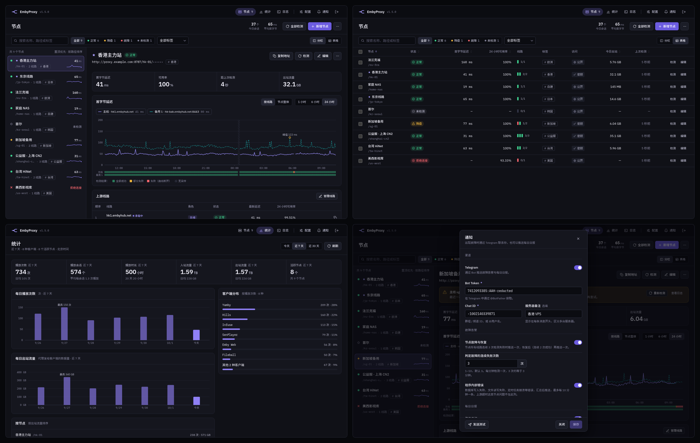

<div align="center">
  
  <h1>EmbyProxy</h1>
  <p>用一个入口代理多台 Emby 服务器：多线路故障转移、逐线路探测与故障告警，自带 Web 管理面板。</p>
  <p>
    <a href="https://github.com/DotRacel/EmbyProxy/tags"></a>
    <a href="https://github.com/DotRacel/EmbyProxy/actions/workflows/release.yml"></a>
    <a href="https://github.com/DotRacel/EmbyProxy/pkgs/container/embyproxy"></a>
    
    <a href="go.mod"></a>
    <a href="#许可证"></a>
  </p>
  <p>
    <a href="#docker-compose">部署</a> ·
    <a href="#配置">配置</a> ·
    <a href="#访问">访问</a> ·
    <a href="#最佳实践">最佳实践</a>
  </p>
</div>



> **重要提醒**
>
> 首次运行前请务必配置 `ADMIN_TOKEN`。它用于登录管理界面和访问管理 API，请不要使用默认值或过短的字符串。

## 程序特点与优势

- **多服务器反代管理**：可以在一个管理界面中维护多个 Emby 服务器节点，为每个节点配置独立名称、上游地址、访问密钥和标签。
- **统一代理入口**：客户端只需要连接当前程序提供的代理地址，即可按节点路径访问不同 Emby 服务器，减少多服务器切换和配置成本。
- **客户端身份伪装**：支持为节点指定客户端身份模板，以预设客户端形态访问上游服务器，适配对客户端类型有要求的播放场景。
- **按节点独立策略**：每个 Emby 节点都可以单独设置是否伪装客户端、是否启用直连访问、上游线路与访问密钥等策略，便于针对不同服务器做差异化配置。
- **Telegram 故障告警**：节点所有上游线路连续多次探测失败时推送故障通知，恢复后再推送恢复通知；程序内部错误（数据库、文件读写等）汇总后推送，带频率限制不刷屏；另有每日播放日报。
- **Web 可视化运维**：节点维护、批量迁移、收藏排序、在线检测和播放统计都集中在管理面板中，多服务器维护更直观。
- **上游线路探测**：后台按分钟逐条探测各节点的上游线路，面板上直接看到延迟走势、每条线路的通断和 24 小时可用率，便于判断是线路问题还是节点问题。
- **轻量本地部署**：Go 单程序运行，使用 SQLite 保存配置和统计数据，通过 Docker Compose 部署，镜像支持 amd64 和 arm64。
- **访问安全控制**：管理界面和管理 API 使用 `ADMIN_TOKEN` 保护，并可通过二维码绑定 TOTP 双重验证；节点也可配置独立密钥。

## Docker Compose

本项目只发布 Docker 镜像，镜像地址：

[https://github.com/DotRacel/EmbyProxy/pkgs/container/embyproxy](https://github.com/DotRacel/EmbyProxy/pkgs/container/embyproxy)

支持 `linux/amd64` 和 `linux/arm64`。每个版本 tag 都会推送同名镜像，正式版同时更新 `latest`。

部署只需要下载 `compose.yml` 和 `.env.example`，并将两个文件放在同一个目录下：

- [`compose.yml`](https://raw.githubusercontent.com/DotRacel/EmbyProxy/main/compose.yml)
- [`.env.example`](https://raw.githubusercontent.com/DotRacel/EmbyProxy/main/.env.example)

`compose.yml` 默认使用远程镜像：

```yaml
image: ghcr.io/dotracel/embyproxy:latest
```

需要固定版本时改成具体 tag，例如 `ghcr.io/dotracel/embyproxy:v1.1.0`。

使用前先将 `.env.example` 复制为 `.env`，然后用文本编辑器打开 `.env`。

打开 `.env` 后，请先把 `ADMIN_TOKEN` 改成自己的管理密钥：

```env
ADMIN_TOKEN=请改成足够长的随机字符串
```

启动：

```bash
docker compose up -d
```

更新：

```bash
docker compose pull
docker compose up -d
```

查看当前程序版本：

```bash
docker compose exec app /app/embyproxy --version
```

## 配置

`.env` 至少需要设置：

```env
ADMIN_TOKEN=用于访问面板的管理密钥
```

常用配置：

| 变量 | 默认值 | 说明 |
| --- | --- | --- |
| `ADMIN_TOKEN` | 无 | 管理界面和管理 API Token，建议改为足够长的随机字符串；启用 2FA 后更改时需重新设置 2FA |
| `ADMIN_2FA_DISABLED` | `false` | 验证器丢失或轮换 `ADMIN_TOKEN` 时临时停用管理员 2FA；修改后需重启，恢复完成后应立即改回 `false` |
| `PORT` | `8787` | HTTP 服务监听端口，程序默认绑定 `0.0.0.0` |
| `DB_PATH` | `./data/proxy.db` | SQLite 数据库路径 |

Docker 运行时建议把 `/app/data` 挂载到宿主机目录，避免容器删除后丢失数据库。

## 访问

程序默认监听 `0.0.0.0:8787`。如果在本机访问，打开：

```text
http://127.0.0.1:8787/admin
```

如果部署在服务器上，将 `127.0.0.1` 替换为服务器 IP 或域名，并确认防火墙或反向代理已按预期放行。

代理路径由管理界面中的节点名称决定，通常形如：

```text
http://服务器地址:8787/节点名/
```

如果节点配置了密钥，路径中还需要包含密钥。

## 最佳实践

### 前置 Caddy 时关闭 HTTP/3

Caddy 默认开启 HTTP/3（QUIC，走 UDP 443），并通过 `Alt-Svc` 响应头让客户端改用它。国内运营商经常对出境 UDP 限速或丢包，而 HTTP/3 会把同一客户端的所有请求复用在一条 UDP 连接上。这条连接一旦被掐断，海报墙上的图片会全部同时加载失败，即使 EmbyProxy 已经从缓存里返回了图片，也送不到客户端。

在 Caddyfile 开头加上全局配置，只保留走 TCP 的 HTTP/1.1 和 HTTP/2：

```caddyfile
{
	servers {
		protocols h1 h2
	}
}
```

修改后执行 `systemctl reload caddy` 生效。这项配置对这台 Caddy 上的所有站点都生效。客户端可能还记着之前收到的 `Alt-Svc`（Caddy 默认有效期 30 天），但 Caddy 不再监听 UDP 443 后，客户端通常会很快回退到 HTTP/2。

## 许可证

本项目采用 MIT License 开源。
